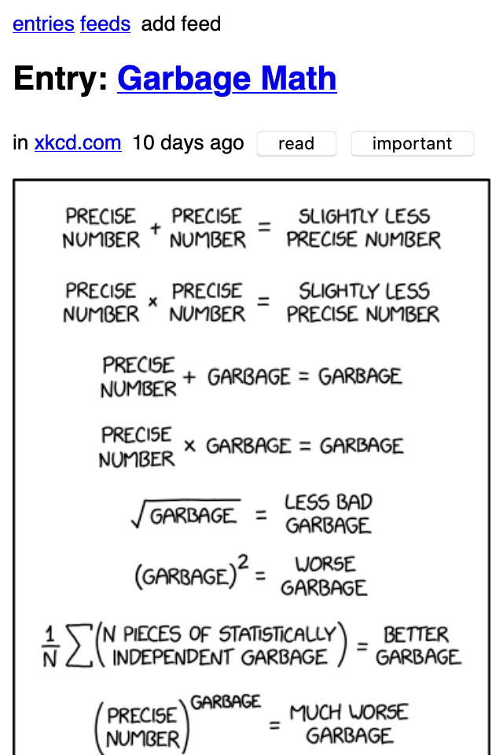
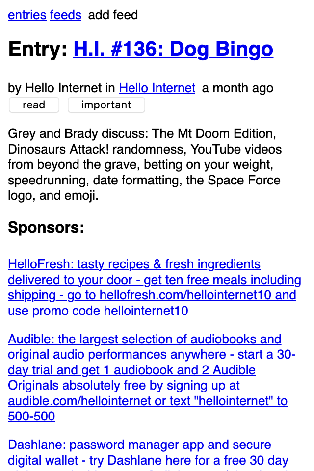
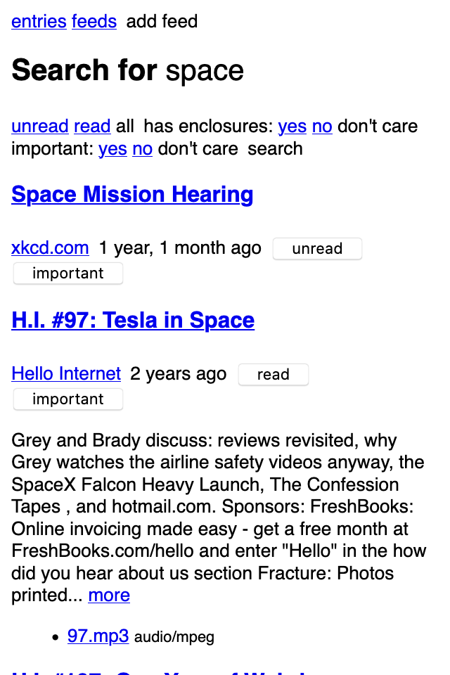

Web application
===============

*reader* comes with a minimal web application, intended to work across
all browsers, including light-weight / text-only ones.

.. warning::

    The web application is not stable yet and might change without any notice.

.. note::

    The web application is optional, use the ``app`` extra to install
    its :ref:`dependencies <Optional dependencies>`.

Serving the web application
---------------------------

*reader* exposes a standard WSGI application as ``reader._app.wsgi:app``.
See the `Flask documentation`_ for more details on how to deploy it.
The path to the reader database can be configured through the
:doc:`config file <config>`
or the ``READER_DB`` environment variable.

.. warning::

    The web application has no authentication / authorization whatsoever;
    it is expected a server / middleware will provide that.

An example uWSGI configuration file (probably not idiomatic, from `here`_)::

    [uwsgi]
    socket = /apps/reader/uwsgi/sock
    manage-script-name = true
    mount = /reader=reader._app.wsgi:app
    plugin = python3
    virtualenv = /apps/reader/
    env = READER_CONFIG=/apps/reader/reader.yaml

You can also run the web application with the ``serve`` command.
``serve`` uses `Werkzeug's development server`_,
so it probably won't scale well past a single user.

.. note::

    For privacy reasons,
    you may want to configure your web server to not send a ``Referer`` header
    (by setting ``Referrer-Policy`` header to ``same-origin``
    for all responses; `nginx example`_).
    The ``serve`` command does it by default.

If running on a personal computer, you can use cron to run ``serve`` at boot::

    @reboot     sleep 60; reader serve -p 8080 2>&1 ) >>"/tmp/$LOGNAME.reader.serve.boot.log"

.. _here: https://github.com/lemon24/owncloud/blob/b6a6ba28f84fa40a1a822c200c9e245bad84600b/reader.yaml#L77
.. _nginx example: https://github.com/lemon24/owncloud/commit/39c5311d9c0973642d3a7dec73369b3607828fdd#diff-4486765de09ef22bfc83d68c7350a8088db6f2ba35f152f49ee36c8ec5aef03d
.. _Flask documentation: http://flask.pocoo.org/docs/1.0/deploying/
.. _Werkzeug's development server: http://werkzeug.pocoo.org/docs/0.14/serving/#werkzeug.serving.run_simple

Screenshots
-----------

Main page
~~~~~~~~~

.. figure:: screenshots/entries.png
    :width: 240px

    main page

Feed page
~~~~~~~~~

.. figure:: screenshots/entries-feed.png
    :width: 240px

    feed page

Feeds page
~~~~~~~~~~

.. figure:: screenshots/feeds.png
    :width: 240px

    feeds page

Entry page
~~~~~~~~~~

    entry page

    entry page

Search page
~~~~~~~~~~~

    search page

Lightweight browsers
~~~~~~~~~~~~~~~~~~~~

.. figure:: screenshots/lynx.png
    :width: 240px

    Lynx

.. figure:: screenshots/dillo.png
    :width: 240px

    Dillo
