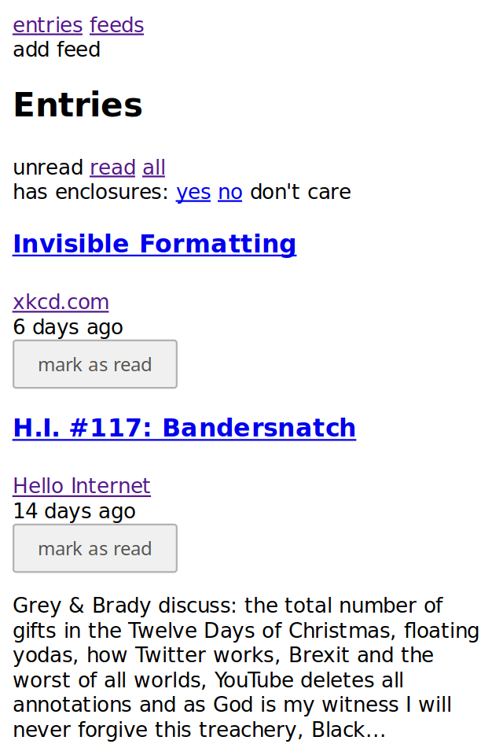
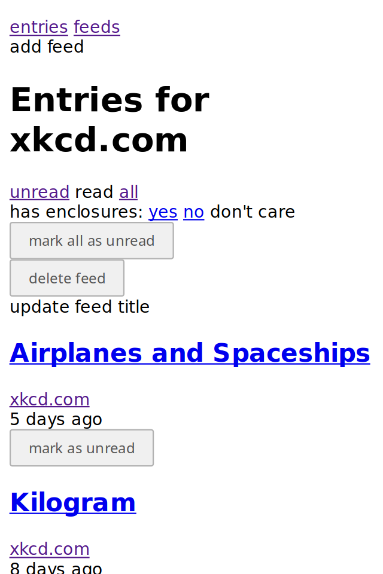
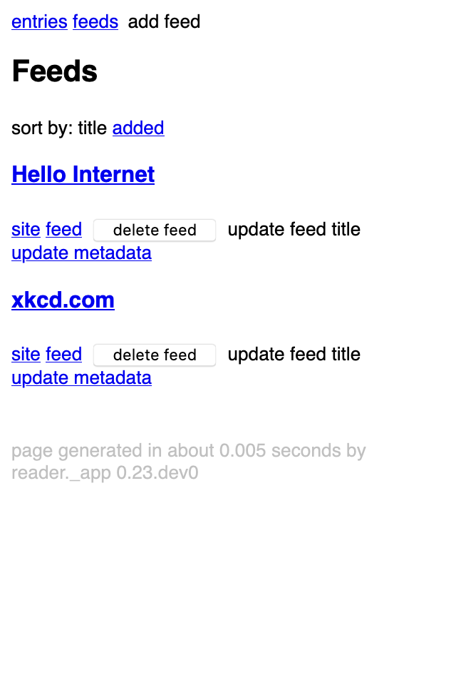
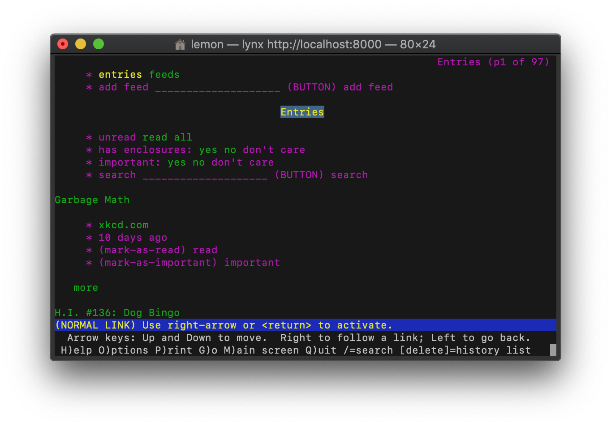
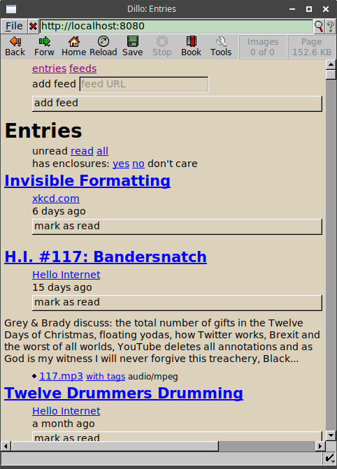

Web application
===============

reader comes with a minimal web application, intended to work across
all browsers, including light-weight / text-only ones.

See :ref:`deploying-app` for how to use it.

Screenshots
-----------

Main page
~~~~~~~~~

    main page

Feed page
~~~~~~~~~

    feed page

Feeds page
~~~~~~~~~~

    feeds page

Lightweight browsers
~~~~~~~~~~~~~~~~~~~~

    Lynx

    Dillo

