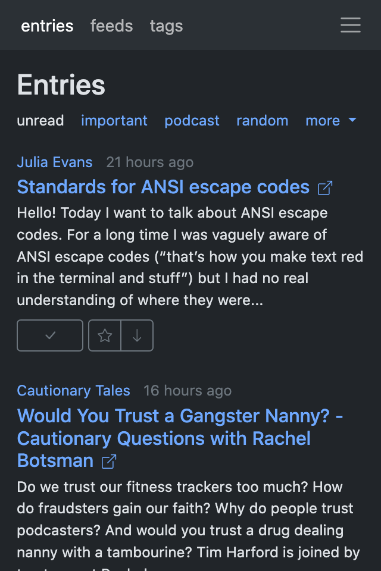
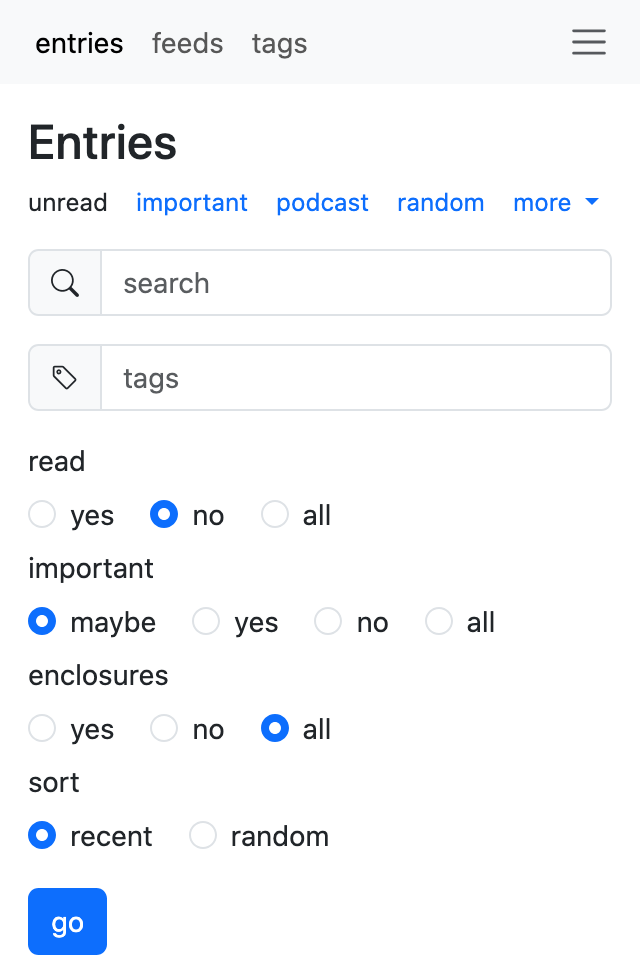
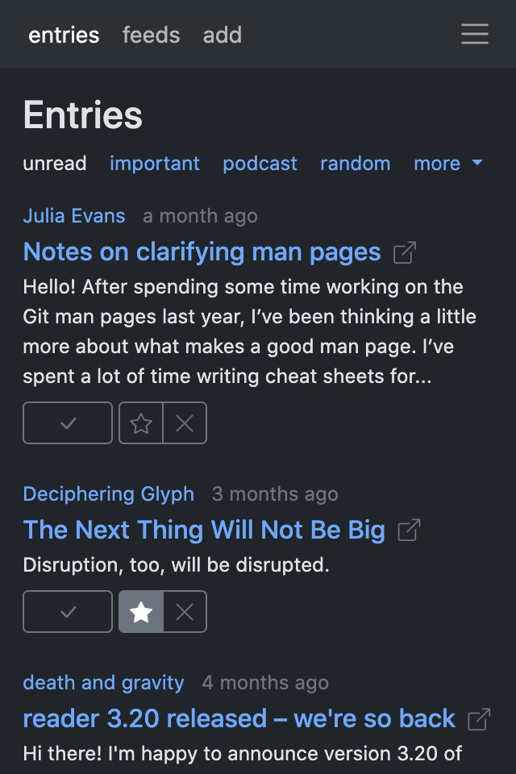
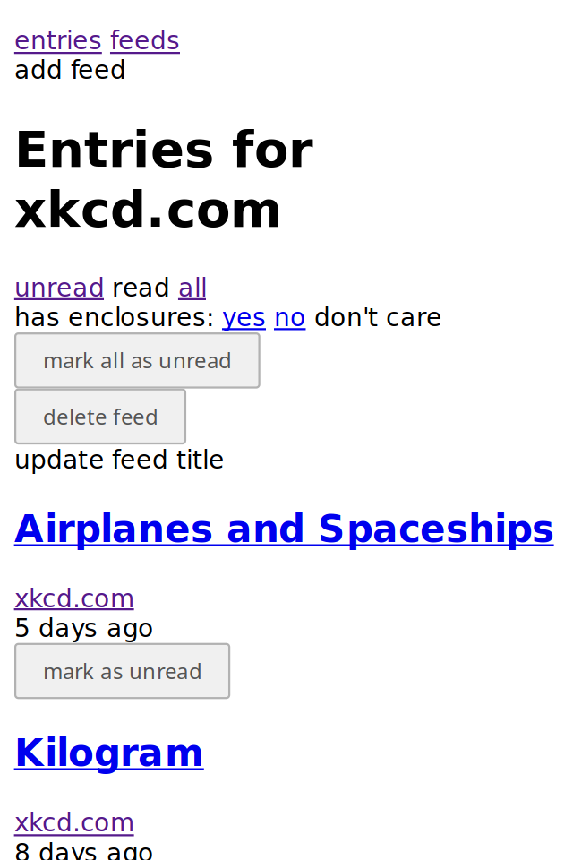
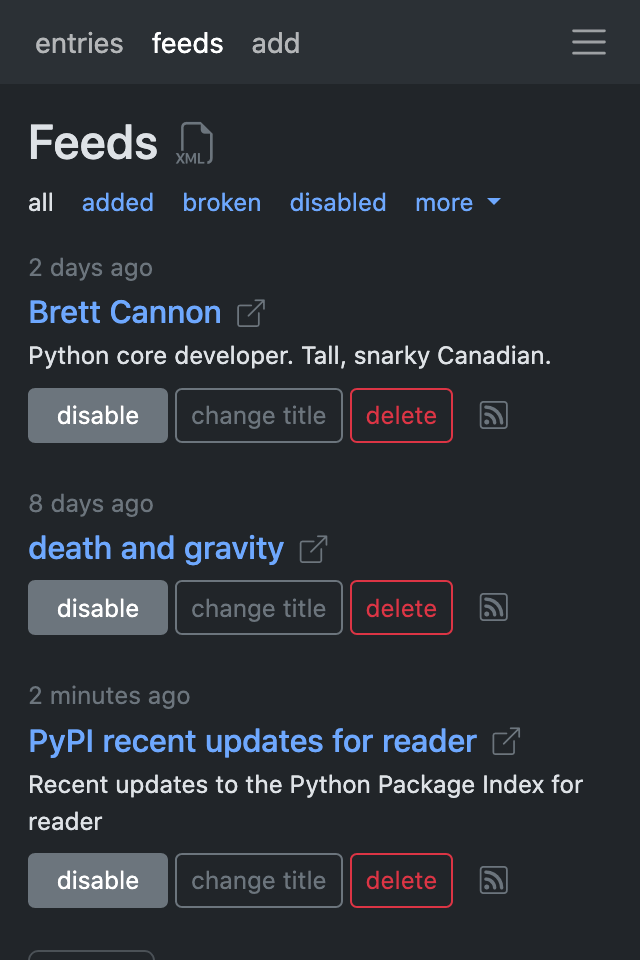
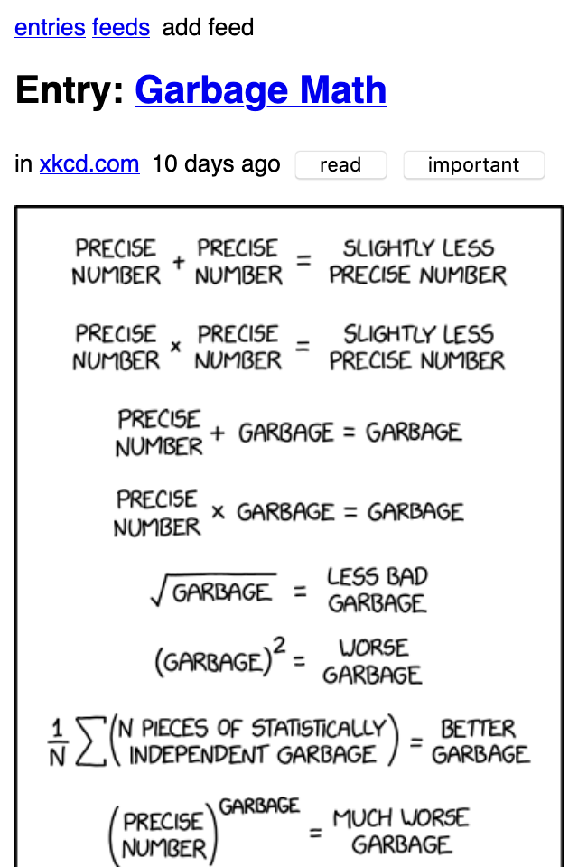
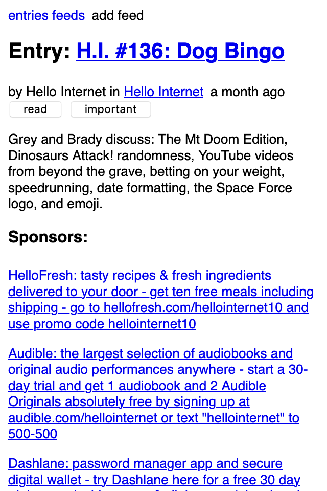
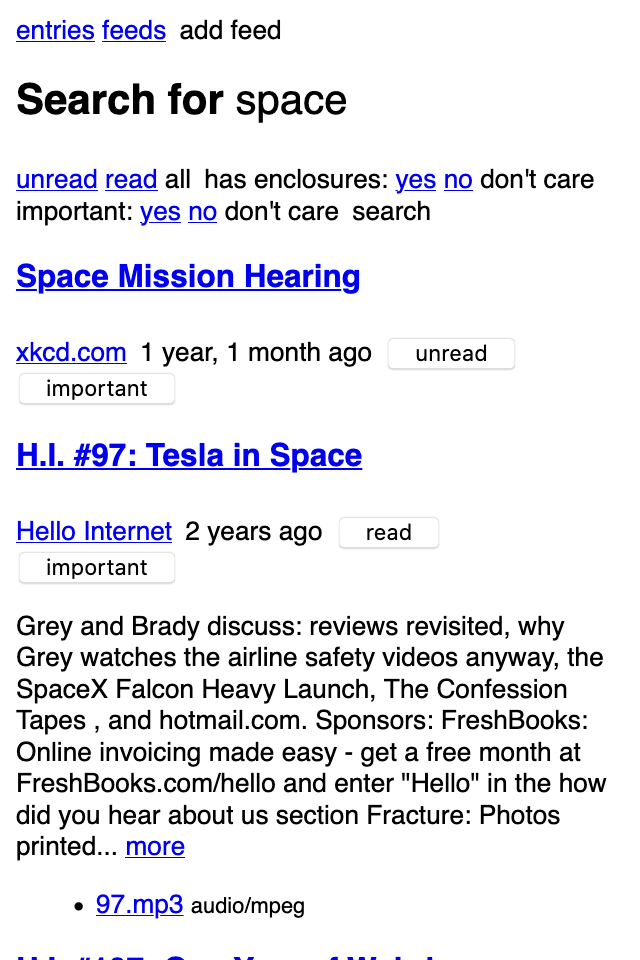
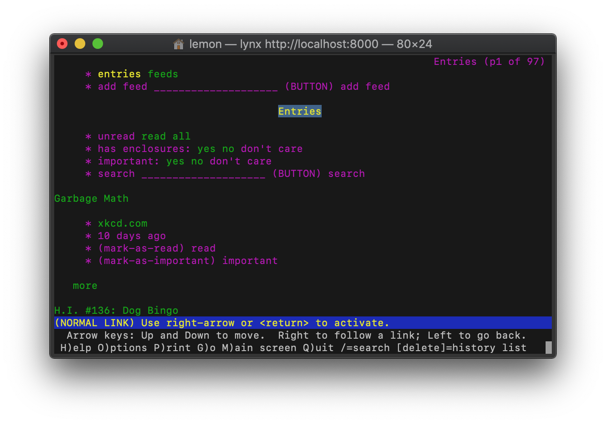
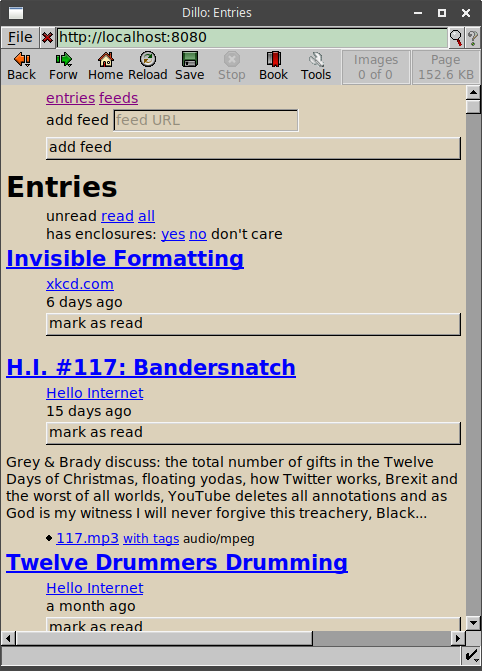

Web application
===============

*reader* comes with a minimal web application, intended to work across
all browsers, including light-weight / text-only ones.

.. warning::

    The web application is not fully supported,
    see the :ref:`roadmap <app roadmap>` for details.

.. note::

    The web application is optional, use the ``app`` extra to install
    its :ref:`dependencies <Optional dependencies>`.

Serving the web application
---------------------------

*reader* exposes a standard WSGI application as ``reader._app.wsgi:app``.
See the `Flask documentation`_ for more details on how to deploy it.
The path to the reader database can be configured through the
:doc:`config file <config>`
or the ``READER_DB`` environment variable.

.. warning::

    The web application has no authentication / authorization whatsoever;
    it is expected a server / middleware will provide that.

An example uWSGI configuration file (probably not idiomatic, from `here`_)::

    [uwsgi]
    socket = /apps/reader/uwsgi/sock
    manage-script-name = true
    mount = /reader=reader._app.wsgi:app
    plugin = python3
    virtualenv = /apps/reader/
    env = READER_CONFIG=/apps/reader/reader.toml

You can also run the web application with the ``web run`` command.
``web run`` uses `Werkzeug's development server`_,
so it probably won't scale well past a single user.

.. note::

    For privacy reasons,
    you may want to configure your web server to not send a ``Referer`` header
    (by setting ``Referrer-Policy`` header to ``same-origin``
    for all responses; `nginx example`_).
    The ``web run`` command does it by default.

If running on a personal computer, you can use cron to run ``web run`` at boot::

    @reboot     sleep 60; reader web run -p 8080 2>&1 ) >>"/tmp/$LOGNAME.reader.web.run.boot.log"

.. _here: https://github.com/lemon24/owncloud/blob/8009f227ef60ebaab621e7bb3363ec9071d8a2e8/reader.yaml#L103-L116
.. _nginx example: https://github.com/lemon24/owncloud/blob/8009f227ef60ebaab621e7bb3363ec9071d8a2e8/secure.conf#L23
.. _Flask documentation: https://flask.palletsprojects.com/en/stable/deploying/
.. _Werkzeug's development server: https://werkzeug.palletsprojects.com/en/stable/serving/#werkzeug.serving.run_simple

.. _app screenshots:

Screenshots
-----------

Following are screenshots of the web app re-design
mentioned in the :ref:`roadmap <app roadmap>`.
For the legacy web app, see `Screenshots (legacy)`_.

Main page
~~~~~~~~~

    main page (dark mode)

    main page – more filters (light mode)

Screenshots (legacy)
--------------------

Following are screenshots of the original (legacy) web app.

Main page
~~~~~~~~~

    main page

Feed page
~~~~~~~~~

    feed page

Feeds page
~~~~~~~~~~

    feeds page

Entry page
~~~~~~~~~~

    entry page

    entry page

Search page
~~~~~~~~~~~

    search page

Lightweight browsers
~~~~~~~~~~~~~~~~~~~~

    Lynx

    Dillo
