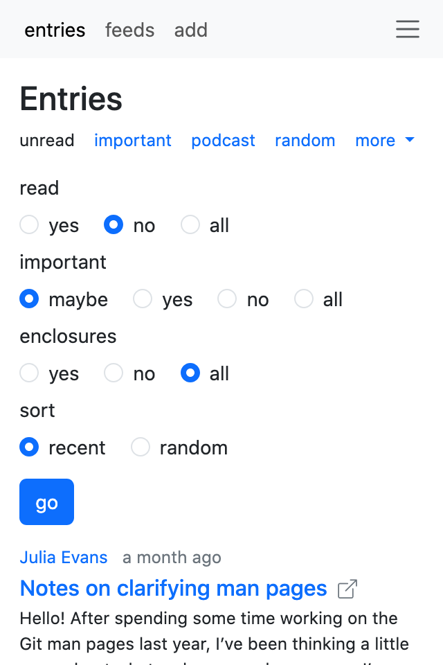
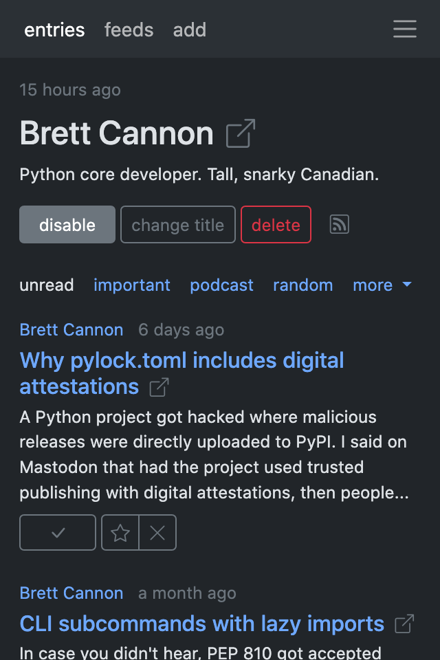
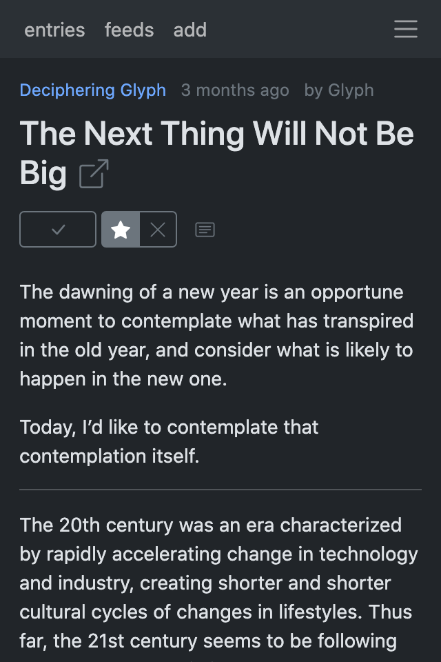
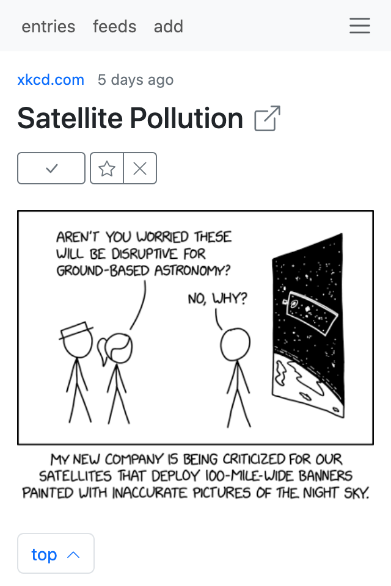
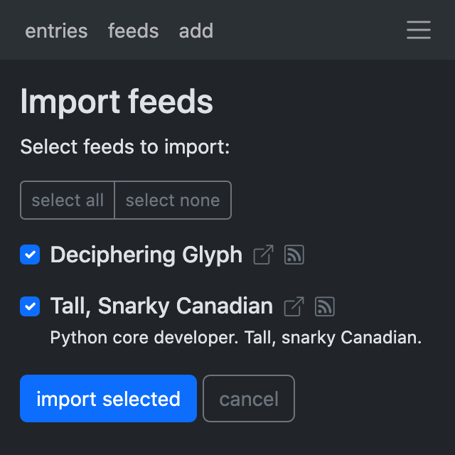
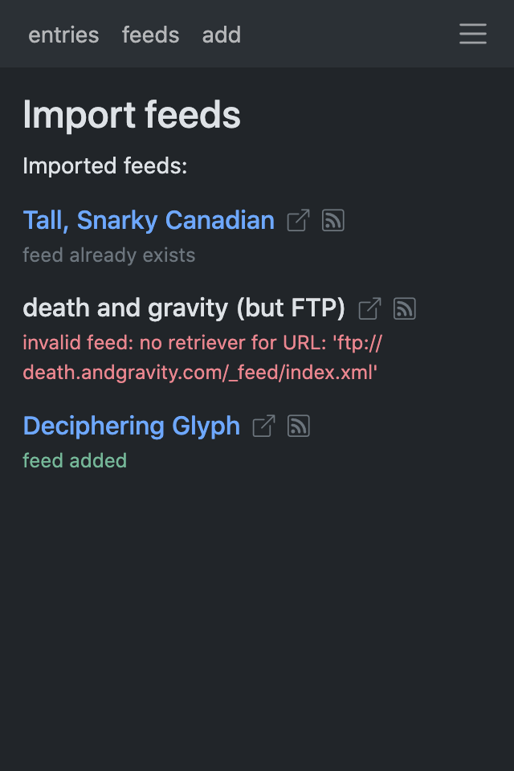
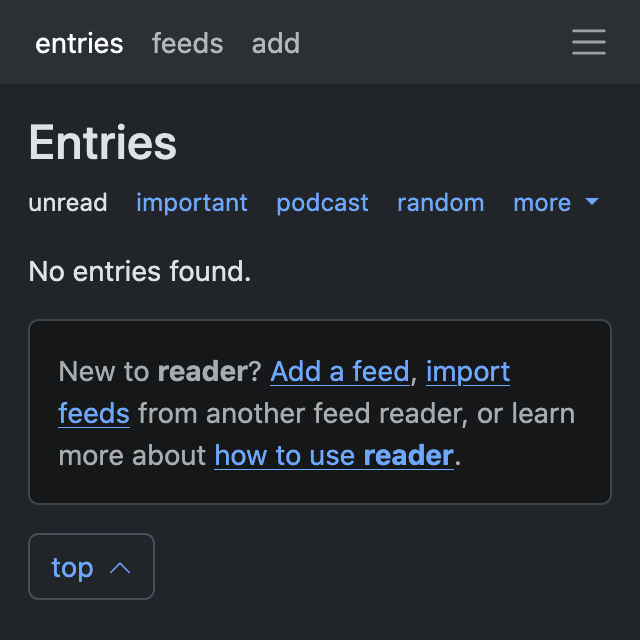
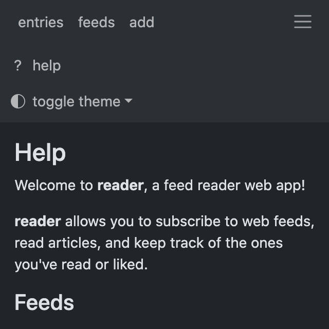
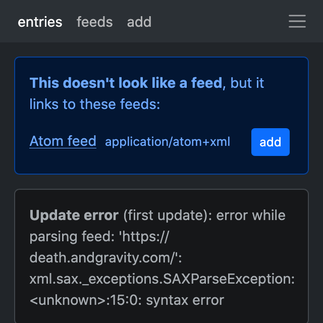
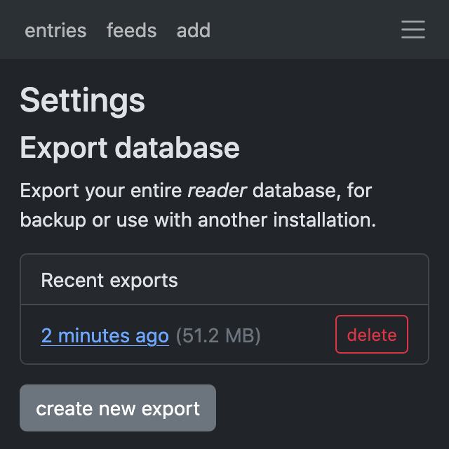

Web application
===============

*reader* comes with a web application
based on  `Flask`_, `Bootstrap`_, and `htmx`_,
intended to work across all browsers,
including mobile and light-weight / text-only ones.

.. _Flask: https://flask.palletsprojects.com/
.. _Bootstrap: https://getbootstrap.com/
.. _htmx: https://htmx.org/

Features, as of *reader* version |version|:

* add / list / filter / delete feeds
* list / filter articles
* mark articles as read / (un)important
* article view
* custom feed titles
* dark mode
* feed autodiscovery
* full data export

More features already implemented in the library
and the :ref:`legacy web app <legacy web app>`
should be added in the next releases;
see the :ref:`roadmap <app roadmap>` for details.

.. _app screenshots:

Screenshots
-----------

.. figure:: screenshots/entries.png
    :width: 240px

    main page (dark mode)

    main page – more filters (light mode)

    feed page (dark mode)

.. figure:: screenshots/feeds.png
    :width: 240px

    feeds page (dark mode)

    article view (dark mode)

    article view (light mode)

.. _screenshots-import:

    import feeds (select)

    import feeds (result)

.. _screenshots-help:

    new user / empty state

    contextual help

.. _screenshots-autodiscovery:

    feed autodiscovery

.. _screenshots-export:

    database exports

Serving the web app
-------------------

.. note::

    The web application is optional, use the ``app`` extra to install
    its :ref:`dependencies <Optional dependencies>`.

*reader* exposes a standard WSGI application as ``reader._app.wsgi:app``.
See the `Flask documentation`_ for more details on how to deploy it.
The path to the reader database can be configured through the
:doc:`config file <config>`
or the ``READER_DB`` environment variable.

.. warning::

    The web application has no authentication / authorization whatsoever;
    it is expected a server / middleware will provide that.

An example uWSGI configuration file (probably not idiomatic, from `here`_)::

    [uwsgi]
    socket = /apps/reader/uwsgi/sock
    manage-script-name = true
    mount = /reader=reader._app.wsgi:app
    plugin = python3
    virtualenv = /apps/reader/
    env = READER_CONFIG=/apps/reader/reader.toml

You can also run the web application with the ``web`` command.
``web`` uses `Werkzeug's development server`_,
so it probably won't scale well past a single user.

.. note::

    For privacy reasons,
    you may want to configure your web server to not send a ``Referer`` header
    (by setting ``Referrer-Policy`` header to ``same-origin``
    for all responses; `nginx example`_).
    The ``web`` command does it by default.

If running on a personal computer, you can use cron to run it at boot::

    @reboot     sleep 60; reader web -p 8080 2>&1 ) >>"/tmp/$LOGNAME.reader.web.run.boot.log"

.. _here: https://github.com/lemon24/owncloud/blob/8009f227ef60ebaab621e7bb3363ec9071d8a2e8/reader.yaml#L103-L116
.. _nginx example: https://github.com/lemon24/owncloud/blob/8009f227ef60ebaab621e7bb3363ec9071d8a2e8/secure.conf#L23
.. _Flask documentation: https://flask.palletsprojects.com/en/stable/deploying/
.. _Werkzeug's development server: https://werkzeug.palletsprojects.com/en/stable/serving/#werkzeug.serving.run_simple

.. _legacy web app:

Legacy web app
--------------

Before the current web application,
there was another one,
serving as test bed for new features.
It is usable, if a bit unpolished,
but was never meant to be a long-term thing,
hence the new app;
you can find screenshots
`here <https://github.com/lemon24/reader/blob/3.21/docs/app.rst#screenshots-legacy>`_.

The WSGI entry point is ``reader._app.legacy.wsgi:app``.

The legacy web app should remain available
until the new app reaches feature parity.
